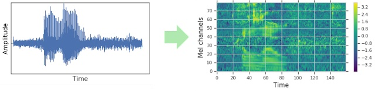
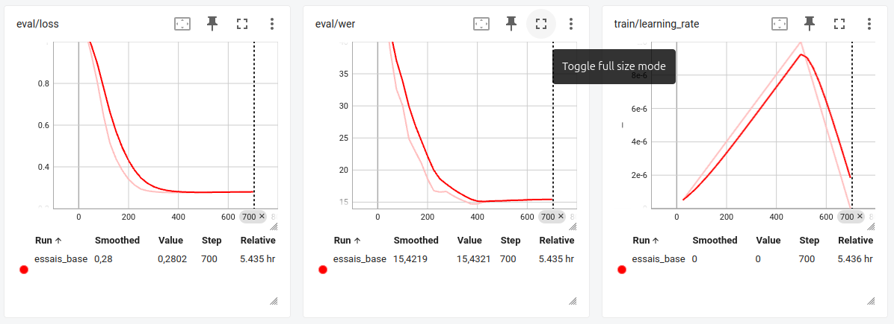
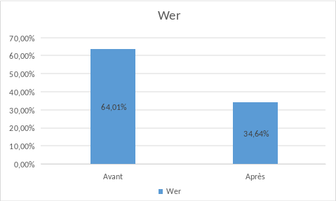

# Fine-tuning Whisper pour la Reconnaissance Automatique de la Parole Médicale en Français

## *Cyrille LORIN (CH de Périgueux)*
Octobre 2024

## Résumé

Cet article explore le processus de fine-tuning du modèle **Whisper** pour la transcription de termes médicaux en français. Nous avons utilisé le modèle Whisper-base et généré nos propres données à l'aide des modèles **LLM Mistral** pour produire des textes médicaux et le **TTS Bark** pour les convertir en audio. Le but de cette étude est de montrer que ce procédé spécifique permet d'améliorer les performances d'un modèle existant. L'article détaille la préparation des données, l'architecture du modèle, et l'évaluation des performances avec la métrique **Word Error Rate** (WER).


## Table des Matières
1. Introduction
2. Fonctionnement de Whisper
3. Versions des Modèles Whisper
4. Préparation de l'Environnement Python
5. Création des Données et Validité
6. Procédure de Fine-Tuning
7. Adaptation pour whisperLive
8. Résultats
9. Conclusion
10. Références

---

## 1. Introduction

La reconnaissance automatique de la parole (ASR) est un domaine en pleine expansion, avec des applications variées notamment dans le secteur médical. Le modèle Whisper d’OpenAI se distingue par sa capacité à transcrire et à traduire automatiquement des enregistrements dans plusieurs langues, en se basant sur 680 000 heures de données audio.

Le besoin de solutions adaptées aux données médicales en français a motivé l'adaptation de Whisper pour des scénarios spécifiques. Cette étude explore comment fine-tuner Whisper pour traiter des termes médicaux.

## 2. Fonctionnement de Whisper

Whisper est un modèle pré-entraîné pour la reconnaissance automatique de la parole (**ASR**) publié en septembre 2022 par OpenAI, conçu pour la **transcription** et la **traduction** dans plus de **96 langues**, dont plusieurs à faibles ressources. Il se distingue par un pré-entraînement massif sur **680 000 heures de données audio étiquetées**, bien plus que ses prédécesseurs comme **Wav2Vec 2.0**, qui utilise 60 000 heures de données non étiquetées.

Contrairement aux approches non supervisées comme **Wav2Vec 2.0**, Whisper apprend une correspondance directe entre la parole et le texte en étant pré-entraîné directement sur des données étiquetées. Sur 680 000 heures de pré-entraînement, **117 000 heures** concernent l’**ASR multilingue**, ce qui permet une large généralisation des points de contrôle pré-entraînés à d’autres langues et domaines. Ce volume de données étiquetées donne à Whisper un avantage, rendant les ajustements supplémentaires minimaux pour des tâches spécifiques comme le domaine médical.

### Architecture de Whisper

Whisper est basé sur un modèle **seq2seq** (séquence à séquence) avec une architecture **transformer**. Le modèle utilise un **codeur-décodeur** dans lequel :
- Le **codeur** transforme l’entrée audio (sous forme de spectrogramme log-Mel) en une séquence d’états cachés.
- Le **décodeur** prédit ensuite les mots de manière autorégressive, en se basant sur ces états cachés et sur les mots précédemment prédits.

#### Fonctionnement
1. **Entrée audio** : Le signal audio est d'abord converti en spectrogramme log-Mel via un extracteur de caractéristiques.
2. **Encodage** : Le spectrogramme est encodé par le **transformer** pour générer une séquence d'états cachés.
3. **Décodage** : Le décodeur prédit la séquence de mots de sortie (texte) en fonction des états cachés et des jetons de texte prédits précédemment.

La **figure 1** ci-dessous illustre cette architecture.


**Figure 1** : Modèle Whisper. L'architecture suit le modèle séquence-séquence transformateur typique. Le spectrogramme est passé dans un codeur, dont les états cachés sont utilisés par le décodeur pour produire de manière autorégressive les mots du texte. Source : OpenAI Whisper Blog.

### Apprentissage et Ajustement

Whisper utilise une fonction objective standard de l’**entropie croisée**, permettant un apprentissage de bout en bout avec une correspondance parole-texte immédiate. Comparé à des approches comme **CTC + nn-gram**, qui utilisent une **fusion superficielle** (modèle linguistique externe), Whisper intègre une **fusion profonde**, où le modèle linguistique est intégré au système, améliorant ainsi la flexibilité et la performance globale.

Lors de son pré-entraînement, Whisper atteint des performances remarquables, notamment un **WER de 3%** sur le sous-ensemble test-propre de **LibriSpeech** et un état de l'art de **4,7%** sur **TED-LIUM**.

Grâce à son architecture flexible et ses capacités multilingues, Whisper peut être finement ajusté pour des langues spécifiques ou des applications spécialisées, comme la transcription médicale, avec un ajustement minimal nécessaire.

## 3. Versions des Modèles Whisper

Whisper est disponible en plusieurs tailles de modèle, qui varient en termes de précision et de consommation de ressources. Nous avons utilisé **Whisper-base** pour notre projet, car il offre un bon compromis entre précision et rapidité d'entraînement pour cette expérience qui a été effectuée sur un ordinateur de bureau sans carte GPU. Le but à terme est d'entraîner des modèles plus larges avec des serveurs de bonne capacité autorisant la transcription et les calculs sur beaucoup plus de paramètres et donc une meilleur performance.

| Version         | Taille (Go) | Paramètres | Largeur des Couches | Couches d'Attention |
|-----------------|-------------|------------|---------------------|---------------------|
| Whisper-tiny    | 0.15        | 39 M       | 384                 | 4                   |
| Whisper-base    | 0.31        | 74 M       | 512                 | 6                   |
| Whisper-small   | 0.46        | 244 M      | 768                 | 12                  |
| Whisper-medium  | 1.5         | 769 M      | 1024                | 24                  |
| Whisper-large   | 2.9         | 1550 M     | 1280                | 32                  |

## 4. Préparation de l'Environnement Python

Voici la liste des modules Python à installer pour préparer l'environnement :

1. **`datasets[audio]`** : pour télécharger et préparer les données d'entraînement audio.
2. **`transformers`** : pour charger et entraîner le modèle Whisper.
3. **`accelerate`** : pour accélérer l'entraînement du modèle.
4. **`evaluate`** : pour évaluer les performances avec des métriques.
5. **`jiwer`** : pour calculer le taux d'erreur de mots (WER).
6. **`tensorboard`** : pour suivre les métriques d'entraînement.
7. **`soundfile`** : pour prétraiter les fichiers audio.
8. **`pandas`** : pour manipuler des DataFrames lors de la création des fichiers CSV d'entraînement et de test.
9. **`sklearn`** : pour diviser les données en ensembles d'entraînement et de test.
10. **`torch`** : pour gérer les tenseurs et entraîner le modèle Whisper.
11. **`ctranslate2`** : pour convertir le modèle en format compatible avec `faster-whisper`.

Cela devrait couvrir tous les modules nécessaires pour exécuter les exemples et le code fournis dans le fichier README.
```sh
pip install --upgrade pip
pip install --upgrade datasets[audio] transformers accelerate evaluate jiwer tensorboard soundfile pandas scikit-learn torch ctranslate2

```
L'utilisation d'un environnement python est conseillé.
Nous vous conseillons vivement de télécharger les checkpoints du modèle directement sur le Hugging Face Hub pendant l'entraînement. Au moins pour le premier entrainement. Par la suite on peut mettre l'adresse physique du modèle déjà téléchargé ou le modèle personnel auparavant entraîné.

## 5. Création des Données et Validité

### Génération de Textes Médicaux avec Mistral

En raison du manque de données médicales vocales authentiques en français, nous avons généré nos propres données à l'aide du LLM **Mistral** pour créer des rapports médicaux couvrant des sujets comme les diagnostics et les traitements. Bien que Mistral puisse produire des textes de qualité variable et discutable du point de vue médicale, notre objectif est d'exposer Whisper aux termes médicaux dans des contextes variés. Ces textes doivent relativement cours pour ne pas dépasser à la lecture 30s. (*voir plus bas*)

### Conversion en Audio avec Bark (Text-to-Speech)

Les textes générés par **Mistral** ont ensuite été convertis en audio grâce au modèle **Text-to-Speech Bark**. Bark simule la lecture des rapports médicaux en utilisant différentes voix (hommes ou femmes), avec des accents variés, des hésitations ou des erreurs, ajoutant ainsi une diversité utile aux données. Cette approche présente l’avantage de générer des données d’entraînement réalistes sans avoir recours à des voix humaines. Ainsi, en se concentrant uniquement sur la qualité des rapports écrits, nous pourrions anonymiser ces documents et entraîner nos modèles sur d'importants volumes de données médicales.

### Structure des Données

Les données sont organisées de la manière suivante pour être utilisées dans le processus de fine-tuning :

```
data/
|  ├── audio/
|  ├── rapports/
├── train.csv
└── test.csv
```

Le fichier CSV contient les chemins vers les fichiers audio et les transcriptions correspondantes, séparés en ensembles d'entraînement et de test. Voici un exemple de code pour générer les fichiers CSV :

```python
import os
import pandas as pd
from sklearn.model_selection import train_test_split

# Define the paths
audio_dir = 'data/audio'
text_dir = 'data/rapports'

# Create a list to hold the data
data = []

# Loop over each file in the audio directory
for audio_file in sorted(os.listdir(audio_dir)):
    if audio_file.endswith('.wav'):  # Assuming the audio files are in .wav format
        # Construct the corresponding text file path
        text_file = os.path.splitext(audio_file)[0] + '.txt'
        text_file_path = os.path.join(text_dir, text_file)
        
        # Read the transcription text if the file exists
        if os.path.exists(text_file_path):
            with open(text_file_path, 'r', encoding='utf-8') as f:
                transcription = f.read().strip()
        
            # Add the information to the data list
            data.append({
                'audio': os.path.join(audio_dir, audio_file),
                'sentence': transcription
            })

# Convert the list to a DataFrame
df = pd.DataFrame(data)

# Split the data into 80% train and 20% test
train_df, test_df = train_test_split(df, test_size=0.2, random_state=42)

# Save the DataFrame to separate CSV files for train and test
train_df.to_csv('train.csv', index=False)
test_df.to_csv('test.csv', index=False)

print("Train and Test CSV files created successfully.")
```
```
Train and Test CSV files created successfully.
```

Nous avons réparti l'ensemble de nos datas (226) en 80% (180) pour l'entrainement et 20%(46) pour le test.

Nous nous retrouvons donc avec des fichiers csv de la forme : 

nom_du_fichier_audio.wav, '*transcription*'


``` csv
audio,sentence
data/audio/151.wav,"Le rapport biologique révèle une thyroïdite de Hashimoto caractérisée par une infiltration lymphocytaire et une fibrose diffuse, confirmant une pathologie auto-immune."
```

## 6. Procédure de Fine-Tuning

Une fois l'environnement et les données prêts, le fine-tuning peut être réalisé en utilisant la bibliothèque Hugging Face. 

### Charger l'ensemble de données (**Dataset**)


```python
from datasets import load_dataset, DatasetDict

# Load the local CSV files for train and test sets
data_files = {
    "train": "data/train.csv",  # Local path to train.csv
    "test": "data/test.csv"     # Local path to test.csv
}

# Load the dataset from the local CSV files
dataset = DatasetDict()
dataset["train"] = load_dataset("csv", data_files={"train": data_files["train"]}, split="train")
dataset["test"] = load_dataset("csv", data_files={"test": data_files["test"]}, split="test")

print(dataset)
```
```
DatasetDict({
    train: Dataset({
        features: ['audio', 'sentence'],
        num_rows: 180
    })
    test: Dataset({
        features: ['audio', 'sentence'],
        num_rows: 46
    })
})
```
Nous utilisons le modèle **Whisper-base** d'OpenAI ("openai/whisper-base") comme point de départ. Lors de la première utilisation, il est téléchargé depuis le hub. Par la suite, nous pouvons spécifier un chemin personnalisé pour **model_name**, soit pour entraîner dans un environnement fermé, soit pour réentraîner un modèle déjà fine-tuné (par exemple, "/home/finetune/finetuned_model").


```python
import torch
from transformers import WhisperForConditionalGeneration, WhisperTokenizer

model_name = "openai/whisper-base"
model = WhisperForConditionalGeneration.from_pretrained(model_name)
tokenizer = WhisperTokenizer.from_pretrained(model_name)
```

## Préparer l'extracteur de caractéristiques (Extractor), le tokenizer et les datas

Le pipeline ASR peut être décomposé en trois éléments :


1.   Un extracteur de caractéristiques qui pré-traite les entrées audio brutes
2.   Le modèle qui effectue le mappage séquence-séquence
3.   Un tokenizer qui post-traite les sorties du modèle au format texte.

Dans 🤗 Transformers, le modèle Whisper est associé à un extracteur de caractéristiques et à un tokenizer, appelés respectivement WhisperFeatureExtractor et WhisperTokenizer.

**Charger l'extracteur de caractéristiques WhisperFeatureExtractor**

Whisper utilise un **extracteur de caractéristiques** qui effectue deux tâches principales pour préparer les entrées audio : 

1. **Uniformisation de la longueur audio** : Chaque fichier audio est ajusté à une durée de 30 secondes, soit en remplissant les fichiers plus courts avec des zéros (silence), soit en tronquant les fichiers plus longs. Cette approche élimine le besoin d'un masque d'attention pour identifier les sections remplies, car Whisper déduit lui-même les zones à ignorer.

2. **Transformation en spectrogramme log-Mel** : L’audio est ensuite converti en **spectrogramme log-Mel**, une représentation visuelle des fréquences audio dans le temps. Le long de l'axe des ordonnées se trouvent les **canaux Mel**, qui représentent des plages de fréquences spécifiques, tandis que l'axe des abscisses représente le temps. Chaque pixel du spectrogramme reflète l’intensité logarithmique de chaque bin de fréquence à un moment donné. Cette représentation est standard dans le traitement de la parole, car elle se rapproche de la perception auditive humaine.

Cette transformation est essentielle pour que Whisper puisse interpréter correctement les entrées audio. Le **spectrogramme log-Mel** est la forme d’entrée attendue par le modèle Whisper, permettant une compréhension plus fine des variations de fréquence, comme illustré dans la **Figure 2** ci-dessous.



**Figure 2** : Représentation d'un spectrogramme log-Mel. À gauche, un signal audio échantillonné ; à droite, le spectrogramme correspondant. Les canaux Mel représentent les fréquences perçues par l'oreille humaine. Source : [Google SpecAugment Blog.](https://ai.googleblog.com/2019/04/specaugment-new-data-augmentation.html)

Le spectrogramme visuel permet d’analyser les composantes fréquentielles du signal audio à chaque instant, crucial pour la transcription vocale par Whisper. Grâce à l'extracteur de caractéristiques de **🤗 Transformers**, ces opérations de padding et de transformation en spectrogramme sont réalisées en une seule ligne de code, facilitant ainsi la préparation des données audio pour l'entraînement ou l'inférence du modèle.

Chargeons l'extracteur de caractéristiques à partir du point de contrôle pré-entraîné pour qu'il soit prêt pour nos données audio :


```python
from transformers import WhisperFeatureExtractor

feature_extractor = WhisperFeatureExtractor.from_pretrained(model_name)
```

## Load WhisperTokenizer
Voyons maintenant comment charger un tokenizer Whisper. Le modèle Whisper produit des jetons de texte qui indiquent l'index du texte prédit dans le dictionnaire des éléments de vocabulaire. Le tokenizer fait correspondre une séquence de jetons de texte à la chaîne de texte réelle (par exemple, [1169, 3797, 3332] -> « le chat s'est assis »).

Traditionnellement, lors de l'utilisation de modèles à encodeur seul pour l'ASR, nous décodons en utilisant la classification temporelle connexionniste ([CTC](https://distill.pub/2017/ctc/)). Dans ce cas, nous devons former un tokenizer CTC pour chaque ensemble de données que nous utilisons. L'un des avantages de l'utilisation d'une architecture codeur-décodeur est que nous pouvons directement exploiter le tokenizer du modèle pré-entraîné.

Le tokenizer Whisper est pré-entraîné sur les transcriptions des 96 langues de pré-entraînement. Par conséquent, il dispose d'une [paire d'octets](https://huggingface.co/course/chapter6/5?fw=pt#bytepair-encoding-tokenization) étendue qui convient à presque toutes les applications ASR multilingues. Pour le français, nous pouvons charger le tokenizer et l'utiliser pour un réglage fin sans aucune autre modification. Il suffit de spécifier la langue cible et la tâche. Ces arguments indiquent au tokenizer de préfixer les tokens de la langue et de la tâche au début des séquences d'étiquettes encodées :


```python
from transformers import WhisperTokenizer

tokenizer = WhisperTokenizer.from_pretrained(model_name, language="French", task="transcribe")
```

Nous pouvons vérifier que le tokenizer encode correctement les caractères en français en encodant et en décodant un échantillon de l'ensemble de données. Lors de l'encodage des transcriptions, le tokenizer ajoute des « jetons spéciaux » au début et à la fin de la séquence, tels que les jetons de début/fin de transcription, de langue et de tâche. Lors du décodage, il est possible de « sauter » ces jetons pour retourner une chaîne similaire à celle de l'entrée originale.


```python
input_str = dataset["train"][0]["sentence"]
labels = tokenizer(input_str).input_ids
decoded_with_special = tokenizer.decode(labels, skip_special_tokens=False)
decoded_str = tokenizer.decode(labels, skip_special_tokens=True)

print(f"Input:                 {input_str}")
print(f"Decoded w/ special:    {decoded_with_special}")
print(f"Decoded w/out special: {decoded_str}")
print(f"Are equal:             {input_str == decoded_str}")
```

    Input:                 L'arthroplastie céphalique a été réalisée avec succès, sans complications peropératoires. La prothèse a été parfaitement intégrée, garantissant une mobilité articulaire optimale et une récupération fonctionnelle rapide.
    Decoded w/ special:    <|startoftranscript|><|fr|><|transcribe|><|notimestamps|>L'arthroplastie céphalique a été réalisée avec succès, sans complications peropératoires. La prothèse a été parfaitement intégrée, garantissant une mobilité articulaire optimale et une récupération fonctionnelle rapide.<|endoftext|>
    Decoded w/out special: L'arthroplastie céphalique a été réalisée avec succès, sans complications peropératoires. La prothèse a été parfaitement intégrée, garantissant une mobilité articulaire optimale et une récupération fonctionnelle rapide.
    Are equal:             True

## Combiner pour créer un WhisperProcessor

Pour simplifier l'utilisation de l'extracteur de caractéristiques et du tokenizer, nous pouvons les regrouper (*wrap*) dans une seule classe **WhisperProcessor**. Cet objet processeur **hérite** des classes **WhisperFeatureExtractor** et WhisperProcessor et peut être utilisé sur les entrées audio et les prédictions du modèle selon les besoins. Ce faisant, nous n'avons besoin de suivre que deux objets pendant l'apprentissage : le processeur et le modèle :


```python
from transformers import WhisperProcessor

processor = WhisperProcessor.from_pretrained(model_name, language="French", task="transcribe")
```

**Préparer les données**

Imprimons le premier exemple de l'ensemble de données *medic* pour voir sous quelle forme se présentent les données :


```python
print(dataset["train"][0])
```

    {'audio': 'data/audio/156.wav', 'sentence': "L'arthroplastie céphalique a été réalisée avec succès, sans complications peropératoires. La prothèse a été parfaitement intégrée, garantissant une mobilité articulaire optimale et une récupération fonctionnelle rapide."}


Nous pouvons voir que nous avons un tableau audio d'entrée à une dimension et la transcription cible correspondante. Nous avons beaucoup parlé de l'importance du taux d'échantillonnage et du fait que nous devons faire correspondre le taux d'échantillonnage de notre audio à celui du modèle Whisper (16kHz). Si notre audio d'entrée était échantillonné à 48kHz ou autre chose que 16Khz, nous devrions le re-échantillonner à 16kHz avant de le passer à l'extracteur de caractéristiques de Whisper.

Nous allons régler les entrées audio sur la fréquence d'échantillonnage correcte à l'aide de la méthode cast_column du jeu de données. Cette opération ne modifie pas l'audio sur place, mais signale aux datasets de rééchantillonner les échantillons audio à la volée la première fois qu'ils sont chargés :


```python
from datasets import Audio

dataset = dataset.cast_column("audio", Audio(sampling_rate=16000))
```

Le rechargement du premier échantillon audio dans l'ensemble de données *Medic* le rééchantillonnera à la fréquence d'échantillonnage souhaitée :


```python
print(dataset["train"][0])
```

    {'audio': {'path': 'data/audio/156.wav', 'array': array([0.00082397, 0.00024414, 0.        , ..., 0.00033569, 0.00024414,
           0.00024414]), 'sampling_rate': 16000}, 'sentence': "L'arthroplastie céphalique a été réalisée avec succès, sans complications peropératoires. La prothèse a été parfaitement intégrée, garantissant une mobilité articulaire optimale et une récupération fonctionnelle rapide."}


Les valeurs du tableau peuvent être différentes.

Nous pouvons maintenant écrire une fonction pour préparer nos données pour le modèle :


1.   Nous chargeons et rééchantillonnons les données audio en appelant batch[« audio »]. Comme expliqué ci-dessus, 🤗 Datasets effectue toutes les opérations de rééchantillonnage nécessaires à la volée.
2.   Nous utilisons l'extracteur de caractéristiques pour calculer les caractéristiques d'entrée du spectrogramme log-Mel à partir de notre tableau audio unidimensionnel.
3.   Nous codons les transcriptions en identifiants d'étiquettes à l'aide du tokenizer.


```python
def prepare_dataset(batch):
    # load and resample audio data from 48 to 16kHz
    audio = batch["audio"]

    # compute log-Mel input features from input audio array
    batch["input_features"] = feature_extractor(audio["array"], sampling_rate=audio["sampling_rate"]).input_features[0]

    # encode target text to label ids
    batch["labels"] = tokenizer(batch["sentence"]).input_ids
    return batch
```

Nous pouvons appliquer la fonction de préparation des données à tous nos exemples d'apprentissage en utilisant la méthode .map du jeu de données :


```python
dataset = dataset.map(prepare_dataset, remove_columns=dataset.column_names["train"], num_proc=4)
```
```
Map (num_proc=4): 100%|██████████| 180/180 [00:06<00:00, 29.36 examples/s]
Map (num_proc=4): 100%|██████████| 46/46 [00:01<00:00, 26.53 examples/s]
```

Très bien ! Avec cela, nous avons nos données entièrement préparées pour l'entraînement ! Continuons et regardons comment nous pouvons utiliser ces données pour affiner Whisper.

> Note : Actuellement, les jeux de données utilisent à la fois torchaudio et librosa pour le chargement et le rééchantillonnage audio. Si vous souhaitez mettre en œuvre votre propre chargement/échantillonnage de données, vous pouvez utiliser la colonne « path » pour obtenir le chemin du fichier audio et ignorer la colonne « audio ».

## Training et Evaluation
Maintenant que nous avons préparé nos données, nous sommes prêts à nous plonger dans le pipeline de formation. Le 🤗 Trainer va faire le gros du travail à notre place. Tout ce que nous avons à faire, c'est :

*   Charger un point de contrôle pré-entraîné : nous devons charger un point de contrôle pré-entraîné et le configurer correctement pour l'entraînement.
*   Définir un collateur de données : le collateur de données prend nos données prétraitées et prépare des tenseurs PyTorch prêts pour le modèle.
* Métriques d'évaluation : lors de l'évaluation, nous voulons évaluer le modèle à l'aide de la métrique du taux d'erreur sur les mots (WER). Nous devons définir une fonction compute_metrics qui gère ce calcul.
* Définir les arguments de formation : ils seront utilisés par le 🤗 *Trainer* pour construire le programme de formation.

Une fois le modèle affiné, nous l'évaluerons sur les données de test afin de vérifier que nous l'avons correctement entraîné à transcrire des termes médicaux.

## Charger un point de contrôle pré-entraîné (Pre-Trained Checkpoint)
Nous commencerons notre cycle de réglage fin à partir du point de contrôle pré-entraîné de Whisper small. Pour ce faire, nous chargerons les poids pré-entraînés du Hugging Face Hub. Encore une fois, cette opération est triviale grâce à l'utilisation de 🤗 Transformers !


```python
from transformers import WhisperForConditionalGeneration

model = WhisperForConditionalGeneration.from_pretrained(model_name)
```

Au moment de l'inférence, le modèle Whisper détecte automatiquement la langue de l'audio source et prédit les identifiants de jetons dans cette langue. Dans les cas où la langue de l'audio source est connue a-priori, comme dans le cas d'un réglage fin multilingue, il est avantageux de définir la langue de manière explicite. Cela permet d'éviter les scénarios dans lesquels la langue incorrecte est prédite, ce qui entraîne une divergence entre le texte prédit et la langue réelle au cours de la génération. Pour ce faire, nous définissons les arguments *language* et *task* dans la configuration de la génération.


```python
model.generation_config.language = "french"
model.generation_config.task = "transcribe"
```

## Définir un collecteur de données (DataCollator)
Le collecteur de données pour un modèle vocal séquence à séquence est unique en ce sens qu'il traite les *input_features* et *labels* indépendamment : les caractéristiques d'entrée (*input_features*) doivent être traitées par l'extracteur de caractéristiques (*extractor*) et les étiquettes (*labels*) par le tokenizer.

Les *input_features* ont déjà été ramenés à 30 secondes et converties en un spectrogramme log-Mel de dimension fixe, de sorte qu'il ne nous reste plus qu'à les convertir en tenseurs PyTorch en lots. Nous le faisons en utilisant la méthode .pad de l'extractor avec return_tensors=pt. Notez qu'aucun rembourrage supplémentaire (*additional padding*)n'est appliqué ici puisque les entrées sont de dimension fixe, les *input_features* sont simplement convertis en tenseurs PyTorch.

En revanche, les *labels* ne sont pas tamponnés (*un-padded*). Nous commençons par ajouter un *pad* aux séquences jusqu'à la longueur maximale du lot à l'aide de la méthode .pad du tokenizer. Les jetons de remplissage (*padding tokkens*)sont ensuite remplacés par -100 afin que ces jetons ne soient pas pris en compte lors du calcul de la perte. Nous coupons ensuite le début du jeton de transcription du début de la séquence d'étiquettes, car nous l'ajouterons plus tard au cours de la formation.

Nous pouvons nous appuyer sur le **WhisperProcessor** que nous avons défini précédemment pour effectuer les opérations d'extraction de caractéristiques et de symbolisation :


```python
import torch

from dataclasses import dataclass
from typing import Any, Dict, List, Union

@dataclass
class DataCollatorSpeechSeq2SeqWithPadding:
    processor: Any
    decoder_start_token_id: int

    def __call__(self, features: List[Dict[str, Union[List[int], torch.Tensor]]]) -> Dict[str, torch.Tensor]:
        # diviser les entrées et les étiquettes, car elles doivent être de longueurs différentes et nécessitent des méthodes de remplissage différentes
        # traite d'abord les entrées audio en renvoyant simplement des tenseurs de torch
        input_features = [{"input_features": feature["input_features"]} for feature in features]
        batch = self.processor.feature_extractor.pad(input_features, return_tensors="pt")

        # Obtenir les séquences d'étiquettes symbolisées
        label_features = [{"input_ids": feature["labels"]} for feature in features]

        # remplir les labels jusqu'à la longueur maximale
        labels_batch = self.processor.tokenizer.pad(label_features, return_tensors="pt")

        # remplacer le remplissage par -100 pour ignorer correctement la perte
        labels = labels_batch["input_ids"].masked_fill(labels_batch.attention_mask.ne(1), -100)

        # si le jeton de début est ajouté lors de l'étape précédente
        # le retirer ici puisqu'il sera de toute façon ajouté plus tard
        if (labels[:, 0] == self.decoder_start_token_id).all().cpu().item():
            labels = labels[:, 1:]

        # définir le masque d'attention
        # créer un masque d'attention
        attention_mask = torch.ones(batch["input_features"].shape, dtype=torch.long)
        attention_mask[batch["input_features"] == 0] = 0

        batch["attention_mask"] = attention_mask
        batch["labels"] = labels

        return batch
```

Initialisons le collecteur de données que nous venons de définir :


```python
data_collator = DataCollatorSpeechSeq2SeqWithPadding(
    processor=processor,
    decoder_start_token_id=model.config.decoder_start_token_id,
)
```

## Evaluations

Après l'entraînement, nous évaluons les performances du modèle avec le **Word Error Rate (WER)**, qui est la métrique standard pour évaluer les systèmes de reconnaissance vocale (ASR). Le WER calcule le pourcentage d'erreurs dans la transcription, en comparant le texte de sortie avec une référence correcte. Nous chargeons la métrique WER via 🤗 **Evaluate**. Pour plus de détails sur le calcul du WER, vous pouvez consulter la [documentation](https://huggingface.co/metrics/wer).


```python
import evaluate

metric = evaluate.load("wer")
```

Il suffit ensuite de définir une fonction qui prend les prédictions de notre modèle et renvoie la métrique WER. Cette fonction, appelée compute_metrics, remplace d'abord -100 par pad_token_id dans les labels_ids (annulant l'étape que nous avons appliquée dans le data collator pour ignorer correctement les tokens padded dans la perte). Il décode ensuite les identifiants prédits et d'étiquettes en chaînes de caractères. Enfin, il calcule le WER entre les prédictions et les étiquettes de référence :


```python
def compute_metrics(pred):
    pred_ids = pred.predictions
    label_ids = pred.label_ids

    # remplacer -100 par l'identifiant du jeton de remplissage
    label_ids[label_ids == -100] = tokenizer.pad_token_id

    # nous ne voulons pas regrouper les jetons lors du calcul des métriques
    pred_str = tokenizer.batch_decode(pred_ids, skip_special_tokens=True)
    label_str = tokenizer.batch_decode(label_ids, skip_special_tokens=True)

    wer = 100 * metric.compute(predictions=pred_str, references=label_str)

    return {"wer": wer}
```

## Définir les arguments de formation (Training Arguments)

Dans la dernière étape, nous définissons tous les paramètres liés à la formation. Un sous-ensemble de paramètres est expliqué ci-dessous :


* *output_dir* : répertoire local dans lequel enregistrer les poids du modèle.
* *generation_max_length* : nombre maximal de tokens à générer de manière autorégressive pendant l'évaluation.
* *save_steps* : pendant la formation, les points de contrôle intermédiaires seront enregistrés et téléchargés de manière asynchrone vers le Hub tous les save_steps pas de formation.
* *eval_steps* : pendant la formation, l'évaluation des points de contrôle intermédiaires sera effectuée tous les eval_steps pas de formation.
* *report_to* : où enregistrer les journaux de formation. Les plateformes supportées sont « azure_ml », « comet_ml », « mlflow », « neptune », « tensorboard » et « wandb ». Choisissez votre plateforme préférée ou laissez « tensorboard ». Nous avons utilisé **Tensorboard**

Pour plus de détails sur les autres arguments d'entraînement, consultez la [documentation](https://huggingface.co/docs/transformers/main_classes/trainer#transformers.Seq2SeqTrainingArguments) Seq2SeqTrainingArguments.


```python
from transformers import Seq2SeqTrainingArguments

training_args = Seq2SeqTrainingArguments(
    output_dir="./whisper-base-french-medic",
    per_device_train_batch_size=16,
    gradient_accumulation_steps=1,  # augmenter par 2x pour chaque réduction de 2x de la taille de lot (batch_size)
    learning_rate=1e-5,
    warmup_steps=500,
    max_steps=700, #5000
    gradient_checkpointing=True,
    fp16=True,
    eval_strategy="steps",
    per_device_eval_batch_size=8,
    predict_with_generate=True,
    generation_max_length=225,
    save_steps=1000,
    eval_steps=25,
    logging_steps=25,
    report_to=["tensorboard"],
    load_best_model_at_end=True,
    metric_for_best_model="wer",
    greater_is_better=False,
    push_to_hub=False,
    run_name="essais_base",
    logging_dir="./whisper-base-french-medic/logs/essais_base"
)
```

Nous pouvons transmettre les arguments d'entraînement au 🤗 Trainer avec notre modèle, notre jeu de données, notre collecteur de données et notre fonction compute_metrics :

```python
from transformers import Seq2SeqTrainer

trainer = Seq2SeqTrainer(
    args=training_args,
    model=model,
    train_dataset=dataset["train"],
    eval_dataset=dataset["test"],
    data_collator=data_collator,
    compute_metrics=compute_metrics,
    tokenizer=processor.feature_extractor,
)
```
```
    max_steps is given, it will override any value given in num_train_epochs
```

Et voilà, nous sommes prêts à commencer l'entraînement !

## Formation (Training)

Pour lancer une formation, il suffit d'exécuter :


```python
torch.utils.checkpoint.use_reentrant = False
trainer.train()
```
```
    {'train_runtime': 20297.6998, 'train_samples_per_second': 0.552, 'train_steps_per_second': 0.034, 'train_loss': 0.181169177887163, 'epoch': 58.33}
    TrainOutput(global_step=700, training_loss=0.181169177887163, metrics={'train_runtime': 20297.6998, 'train_samples_per_second': 0.552, 'train_steps_per_second': 0.034, 'total_flos': 6.8128939966464e+17, 'train_loss': 0.181169177887163, 'epoch': 58.333333333333336})
```

L'entraînement a duré 5h37, et peut varier en fonction du modèle de base, de l'utilisation ou non d'un GPU ou de celui alloué au Google Colab si vous l'effectuez avec. Il est possible que vous rencontriez une erreur CUDA « out-of-memory » lorsque vous commencez l'entraînement. Dans ce cas, vous pouvez réduire la taille du lot  (per_device_train_batch_size) par incréments d'un facteur 2 et utiliser les étapes d'accumulation du gradient (gradient_accumulation_steps) pour compenser.

On donne le nom de notre modèle entraîné et on le sauvegarde


```python
finetuned_directory = "./whisper-base-ch-perigueux"
model.save_pretrained(finetuned_directory)
processor.save_pretrained(finetuned_directory)
```
```
    Some non-default generation parameters are set in the model config. These should go into a GenerationConfig file (https://huggingface.co/docs/transformers/generation_strategies#save-a-custom-decoding-strategy-with-your-model) instead. This warning will be raised to an exception in v4.41.
    Non-default generation parameters: {'max_length': 448, 'suppress_tokens': [1, 2, 7, 8, 9, 10, 14, 25, 26, 27, 28, 29, 31, 58, 59, 60, 61, 62, 63, 90, 91, 92, 93, 359, 503, 522, 542, 873, 893, 902, 918, 922, 931, 1350, 1853, 1982, 2460, 2627, 3246, 3253, 3268, 3536, 3846, 3961, 4183, 4667, 6585, 6647, 7273, 9061, 9383, 10428, 10929, 11938, 12033, 12331, 12562, 13793, 14157, 14635, 15265, 15618, 16553, 16604, 18362, 18956, 20075, 21675, 22520, 26130, 26161, 26435, 28279, 29464, 31650, 32302, 32470, 36865, 42863, 47425, 49870, 50254, 50258, 50358, 50359, 50360, 50361, 50362], 'begin_suppress_tokens': [220, 50257]}
```
## 7. Adaptation pour whisperLive

Pour la reconnaissance vocale en temps réel, **faster-whisper** est une variante optimisée de **Whisper** conçue pour des performances plus rapides avec un compromis sur l’utilisation de ressources. Les modèles **Whisper** standards sont plus lourds, mais offrent une plus grande précision en traitement par lot. **Faster-whisper** utilise **CTranslate2**, une bibliothèque spécialisée pour l’inférence rapide, particulièrement utile en temps réel ou sur des appareils à faible puissance. 

Pour passer un modèle **Whisper** en **faster-whisper**, il faut convertir le modèle en utilisant **CTranslate2** et récupérer le fichier **tokenizer.json** du modèle préalablement fine-tuné, afin de maintenir la cohérence du vocabulaire lors de l'inférence.

```python
import os
import tokenizers

tokenizer_file = os.path.join(finetuned_directory, "tokenizer.json")
print(f"save  {tokenizer_file}", end="")
hf_tokenizer = tokenizers.Tokenizer.from_pretrained(model_name)
# enregistrer le tokenizer dans un fichier dans le répertoire spécifié
hf_tokenizer.save(tokenizer_file)
print(" Ok")
```
```
    save  ./whisper-base-ch-perigueux/tokenizer.json Ok
```

```python
import shutil
import ctranslate2

# Chemin vers le dossier où le modèle est sauvegardé dans le format
output_dir = f"{finetuned_directory}-faster-whisper"

# Valeurs possibles pour quantization:

#     "int8" : Quantification en 8 bits pour réduire la taille du modèle, souvent utilisé pour les inférences sur CPU.
#     "int16" : Quantification en 16 bits, un compromis entre la vitesse et la précision.
#     "float16" : Utilisé pour les inférences sur GPU, où les calculs peuvent être effectués en 16 bits flottants.
quantization = "int16"

# Convertir le modèle en CTranslate2
converter = ctranslate2.converters.TransformersConverter(finetuned_directory)
converter.convert(output_dir, quantization=quantization, force=True)

print(f"Le modèle a été converti et sauvegardé dans {output_dir}")

shutil.copy(tokenizer_file, output_dir)
print(f"Fichier {tokenizer_file} copié dans {output_dir}")
```
```
    Le modèle a été converti et sauvegardé dans ./whisper-base-ch-perigueux-faster-whisper
    Fichier ./whisper-base-ch-perigueux/tokenizer.json copié dans ./whisper-base-ch-perigueux-faster-whisper
```
## 8. Résultats

Les graphiques générés par TensorBoard montrent les performances du modèle au cours de l'entraînement :

|


1. **Perte (eval/loss)** : La perte diminue régulièrement, atteignant environ 0,28, signe de la convergence du modèle. Cette stabilisation après 600 étapes indique une bonne optimisation.

2. **WER (Word Error Rate)** : Le WER suit une baisse significative, passant de 35 % à environ 15 %, montrant que le modèle améliore la transcription.

3. **Taux d'apprentissage** : Le taux d'apprentissage suit un schéma de "warm-up" puis décroît. Cette approche, classique en optimisation, aide à éviter l'instabilité initiale et facilite la convergence vers une solution optimale. 

L'ensemble des graphiques démontre une progression positive avec une bonne stabilité du modèle après plusieurs itérations.

### Calcul du WER sur les données audio test:
Le **WER** calculé avant et après l'entraînement, sur des audios tests qui n'ont pas été '*entendus*' par les deux modèles, passe de **64,01%** à **34,64%.**




## 9. Conclusion

Le fine-tuning de Whisper pour la transcription des termes médicaux en français démontre qu'il est possible d'améliorer les performances même avec un ensemble de données généré artificiellement. En utilisant des technologies comme Mistral et Bark, nous avons pu générer des données vocales médicales et fine-tuner le modèle de manière efficace. Le WER a été réduit de manière significative avec 180 petits rapports médicaux, rendant cette approche prometteuse.

## 10. Références

- Radford, Alec, et al. (2022). "Whisper: Multilingual and multitask speech recognition model." OpenAI.
- [Hugging Face - Fine-tune Whisper](https://huggingface.co/blog/fine-tune-whisper)
- [Hugging Face - Word Error Rate (WER)](https://huggingface.co/metrics/wer)
- Google AI. (2019). "SpecAugment: A New Data Augmentation Method for Speech Recognition." [Google Blog](https://ai.googleblog.com/2019/04/specaugment-new-data-augmentation.html)
- [GitHub Repository - Finetuning Whisper](https://github.com/sirius911/Finetuning)
